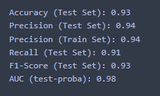
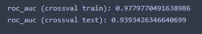
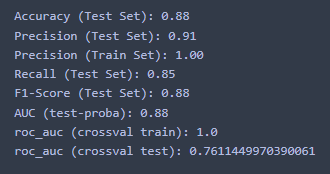
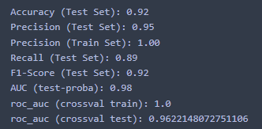
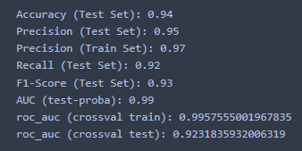
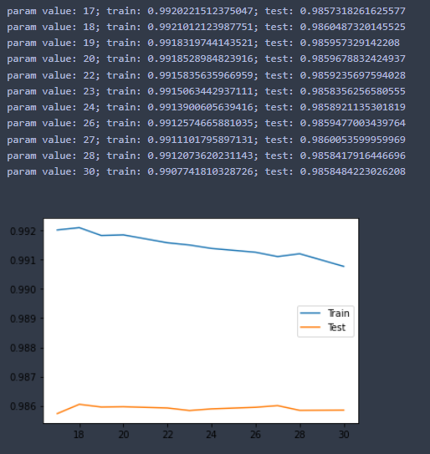
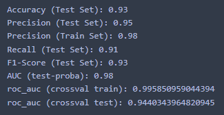
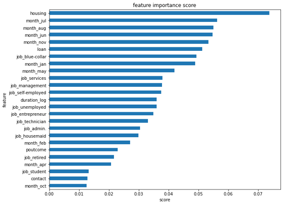

# Bank Target Marketing
Deposito merupakan salah satu investasi yang ada di bank dan merupakan salah satu cara bank untuk mendapatkan modal.Uang Anda diinvestasikan untuk tingkat bunga yang disepakati selama jangka waktu atau jangka waktu tertentu. kampanye melalui telepon merupakan salah satu cara untuk mendapatkan nasabah agar mau deposito berjangka. namun, di butuhkan investasi besar untuk melakukan kampanye itu dengan menyewa call center etc. oleh karena itu, sangat penting bagi kita untuk menidentifikasi pelanggan mana yang berpeluang untuk ikut deposito berjangka sehingga mereka dapat di targetkan terlebih dahulu untuk di lakukan kampanye, dan yang di identifikasi tidak iktu deposito berjangka agar tidak di lakukan kampanye, sehingga investasi kampanye dapat di lakukan efektif dan efisien.

## Partner
- Adelia Sekarsari
- Ahmad Zaky S.
- Andri Pradipta 
- Dear M. Ridlo
- Fathurrahman S 
- M Nurmayyahdi A
- Mirza Purta A
- Ricardo

## Methods Used
- Inferential Statistics
- Machine Learning
- Data Visualization
- Predictive Modeling
- etc.

## Technologies
- Python
- Pandas 
- jupyter
- numpy
- matplotlib
- seaborn
- google colab

## Prerequisite
1. download dataset [banking](https://www.kaggle.com/datasets/prakharrathi25/banking-dataset-marketing-targets)
2. install [Anaconda Navigator](https://www.anaconda.com/products/distribution)
3. atau dapat menggunakan [google colab](https://colab.research.google.com/)

## Project step
1. Preparation
2. EDA, Insight, & Visualization
3. Data Pre-Processing
4. Machine Learning Modeling & Evaluation
5. Final Preparation

### 1. Preparation
#### Problem Statement
Suatu bank yang ingin mengurangi cost terkait teller dan  marketing dengan mengkategorikan/pengelompokkan nasabah yang berprospek atau berpeluang membuka deposito.

#### Goals
Membuat model untuk mendeteksi user yang berpotensi membuka deposito, sehingga client tersebut akan diprioritaskan untuk diberikan marketing

#### Objective
Menurunkan Cost Marketing

#### Business Metrics
Meningkatkan conversion rate dan menurunkan cost Marketing

### 2. EDA, Insight, & Visualization
#### Descriptive Statistic

1. age (numeric)
2. job : type of job (categorical: "admin.","unknown","unemployed","management","housemaid","entrepreneur","student",
"blue-collar","self-employed","retired","technician","services")
3. marital : marital status (categorical: "married","divorced","single"; note: "divorced" means divorced or widowed)
4. education (categorical: "unknown","secondary","primary","tertiary")
5. default: has credit in default? (binary: "yes","no")
6. balance: average yearly balance, in euros (numeric)
7. housing: has housing loan? (binary: "yes","no")
8. loan: has personal loan? (binary: "yes","no")
9. contact: contact communication type (categorical: "unknown","telephone","cellular")
10. day: last contact day of the month (numeric)
11. month: last contact month of year (categorical: "jan", "feb", "mar", …, "nov", "dec")
12. duration: last contact duration, in seconds (numeric)
13. campaign: number of contacts performed during this campaign and for this client (numeric, includes last contact)
14. pdays: number of days that passed by after the client was last contacted from a previous campaign (numeric, -1 means client was not previously contacted)
15. previous: number of contacts performed before this campaign and for this client (numeric)
16. poutcome: outcome of the previous marketing campaign (categorical: "unknown","other","failure","success")
17. y - has the client subscribed a term deposit? (binary: "yes","no")

terdapat beberapa yang ada missing value (job,education,contact,poutcome) yang semuanya categorical

#### Univariate Statistic
##### Boxplot

##### KDEplot

##### Barplot

#### Multivariate Statistic
##### Heatmap

#### Business Insight

### 3. Data Pre-Processing
#### Data Cleansing
Unknown merupakan data dengan missing value pada Dataset Banking and Marketing

Pada variable job, kami melakukan drop data karena jumlah data relatif sedikit
Sedangkan pada variable education, contact, dan poutcome, kami menggunakan nilai modus untuk mengisi missing value dengan nilai terbanyak

#### Handling duplicated data
Tidak ada duplikasi data pada Dataset Banking and Marketing

#### Handling Outliers
untuk Handling Outliers kita menggunakan metode IQR untuk ['age'], Z-score untuk ['previous','duration','balance','campaign'] agar tidak terlalu banyak outlier yang di hapus jika menggunakan IQR semua

Sebelum Imputation

Setelah Imputation

Masih terdapat outlier pada beberapa varible. Hal ini disebabkan oleh penggunaan metode z-score yang tidak menghapus seluruh outlier. Akan tetapi, pemilihan metode ini dilakukan agar jumlah data yang mengaalami clensing tidak banyak atau kurang dari 10%. Setelah dilakukan cleansing, jumlah data menjadi 41444 yang sebelumnya sebanyak 44923 dimana persentase cleansing data sebanyak 7,7%

#### Feature Transformation
Log transformation

Setelah melakukan feature transformation terhadap ketiga metode, Kami memutuskan untuk mwnggunakan transformasi logaritma untuk variable balance dan duration, sedangkan untuk variable lainnya tidak dilakukan perubahan

#### Feature Encoding
##### 1.Label Encoding

kolom yang di ubah menggunakan label encoding adalah ['marital','education','default','housing','loan','contact','poutcome']

##### One-hot Encoding

kolom yang di ubah menggunakan one-hot encoding adalah ['job','bulan']

#### Feature Engineering
##### Feature Selection
Varible 'pday' dihapus karena kurang relevan terhadap modeling yang akan dibuat

##### Feature Extraction
Kami tidak melakukan feature extraction karena setelah dilakukan feature extraction terhadap beberapa kolom yaitu kolom age, balance, dan duration, korelasi tidak berubah bahkan cenderung menurun

### 4. Machine Learning Modeling & Evaluation

#### Class Imbalance
karena target imbalance, maka kami lakukan oversampling.SMOTE, agar pe-modelan lebih baik lagi.
#### Modelling
Pada tahap processing, kami mencoba menggunakan 4 algoritma modelling yaitu Logistic Regression, DecisionTree, Random Forest, dan XGBoost

##### Logistic Regression

##### Decision Tree

##### Random Forest

##### XGBost

##### Result

Berdasarkan hasil evaluasi, kami memutuskan untuk menggunakan algoritma XGBoost. Hal ini dikarenakan, penggunaan Logistic regression dianggap kurang tepat karena fitur yang digunakan non-linear. Sedangkan untuk Decision tree dan Random forest, hasil evaluasi menunjukkan bahwa terdapat overfitting pada hasil modelling. Pada XGBoost, nilai evaluasi lebih baik disbanding 3 algoritma lainnya dimana overfitting minimum

#### Model Evaluation
Kami menggunakan matrix evaluasi berupa nilai precision. Penggunaan matrix precision pada evaluasi kami gunakan sesuai dengan business matrix yang kami tetapkan sebelumnya (STAGE 0) dimana kami menfokuskan pada pengurangan cost dalam melakukan marketing ke client bank. Dalam hal ini, penggunaan precision akan memvalidasi nilai False Positive atau kesalahan prediksi berupa penetapan client yang seharusnya tidak melakukan subscribe tetapi diprediksi akan melakukan subscribe. Dengan focus terhadap nilai precision, kesalahan tersebut akan terminimalisir yang selanjutnya diharapkan akan meminimalkan cost saat melakukan marketing.

Berdasarkan gambar diatas, dapat dilihat bahwa seluruh matrix evaluasi memiliki nilai yang cukup baik, serta pada matrix precision, nilai test dan train tidak mengalami overfitting. Akan tetapi,  mempertimbangkan hasil algoritma lainnya yang berindikasi overfitting, kami memutuskan untuk melakukan tunning hyperparameter.

Berdasarkan nilai cross validation dapat kita lihat bahwa model mengalami overfitting sehingga kami mencoba untuk melakukan hyperparameter tunning

Berdasarkan gambar diatas (parameter min_child_weight), kami menggunakan nilai dengan range 27-28 untuk melakukan hyperparameter tunning

Setelah dilakukan hyperparameter tunning, diperoleh nilai presisi sebesar 0,95 untuk data test dan 0,98 untuk data train. Kami memvalidasi nilai tersebut terhadap hasil cross validation dimana setelah dilakukan tunning, cross validation pada data test mengalami peningkatan sebesar 0,02 atau 2%

#### Feature Important

Beberapa fitur yang memiki yang besar terhadap bisnis seperti fitur housing, loan, month (juli, agustus, juni)

Untuk marketing selanjutnya, bank dapat fokus terhadap client yang memiliki housing dan loan serta melakukan marketing pada pertengahan tahun atau mulai dari bulan juni-agustus

## Reference
test edit
